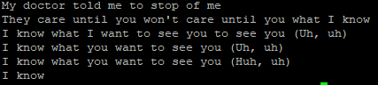
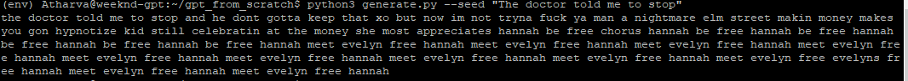
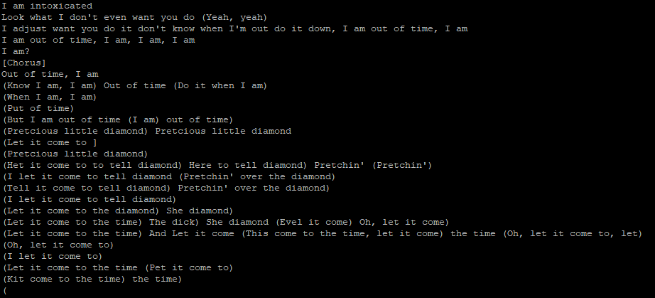
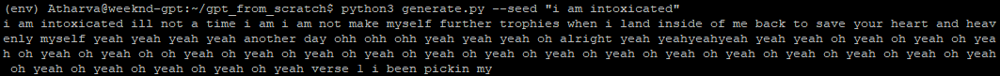
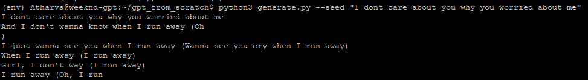
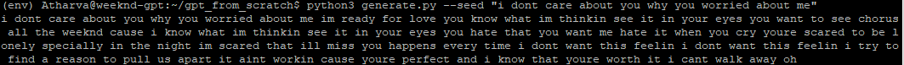

# Generative Pre-trained Transformer From Scratch

This project implements a decoder-only Generative Pre-trained Transformer from scratch in pure PyTorch. GPT is the backbone of the ChatGPT we all use. It generates output text based on the input text (query).

- Inputs : The query token sequence
- Output : The generated tokens on top of our query.

Trained on tow corpora to validate the architecture's generality and we name the submodels as:
    - ShakespeareGPT (Trained on TinyShakespeare)
    - WeekndGPT (Trained on 300+ Weeknd Songs fetched via LyricsGenius)

## Architecture Overview:

- Tokenizer: The tokenizer's purpose is break down our sentences into tokens. 1 token is roughly 3/4th of a word.

- Embeddings: These are the numerical representations of the tokens in multi dimensional space.

- Positional Encodings: The positional information of the tokens. Helps model understand that "dog bites man" is distinct from "man bites dog" or "man dog bites".

- Masked Multi-Head Attention: We linearly project the queries, keys and values h times with different, learned linear projections to dq, dk, and dv. We perform the attention fucntion parallel on each of these projected versions.

- FeedForward: In transformer specifically two linear projects with a ReLU in between. Input (d_model) -> Linear -> ReLU -> Linear -> Output(d_model)

- Decoder Block: Complete block consisting of Multi-Head Attention -> Add & Norm -> FeedForward -> Add & Norm.

- LM Head: Linear layer that projects from embedding dimension to vocabulary size, converts embeddings back to token probabilities

```
TokenEmbedding -> PostionalEncoding -> N × DecoderBlock -> LM Head

DecoderBlock:
    MaskedMultiHeadAttention -> Dropout(p=0.1) -> LayerNorm -> FeedForward -> Dropout(p=0.1) -> LayerNorm
```

## SubModels

### ShakespeareGPT

Trained on TinyShakespeare using tiktoken GPT-2 tokenizer (vocab: 50,257)

| Split | Loss |
|---|---|
| Train | 3.87 |
| Test | 4.46 |
 
Epoch: 900
 
---

### WeekndGPT

Trained on custom corpus of 300+ Weeknd songs using a character-level and a word-level tokenizer.


[](https://api.wandb.ai/links/atharva84-none/zsszi3ao)
[](https://api.wandb.ai/links/atharva84-none/zsszi3ao)

[*Interactive report here ->*](https://api.wandb.ai/links/atharva84-none/zsszi3ao)


| Hyperarameters | Character Token | Word Token |
|---|---|---|
| *d_model* | 256 | 256 |
| *H* | 8 | 8 |
| *N* | 4 | 4 |
| *context_len* | 256 | 256 |
| *batch_size* | 256 | 64 |
| *num_epochs* | 3000 | 3000 |


#### Findings

| Approach | Vocab Size | Tokens | Notes |
|---|---|---|---|
| Character-level | 167 | 819K | Character-level performed slightly better than word-level given the same amount of data |
| Word-level | 5421 | 144K | Data starvation — too few examples per word for a 5421-word vocabulary |

Word-level tokenization often superior to the character-level requires significantly more data to work. With only 144K tokens across a 5421 word vocab, most words appeared too infrequenctly for the model to capture the meaningful context. Character-level takes the win for small corpus by reducing the vocabulary to 167 characters, giving the model 819k training examples to learn from.


#### Generated Samples

**seed:** `doctor told me to stop`

#### Character Level


#### Word Level



**seed:** `I am intoxicated`

#### Character Level         


#### Word Level



**seed:** `I dont care about you why you worried about me`

#### Character Level


#### Word Level



### Limitations

**Context Degradation:** The Generation quality for Character level degrades after ~150 tokens(characters). Corpus capacity is the bottleneck limiting us to a miniature model — not a bug.

## Whats Next? — R&B GPT

- Scrape Drake, SZA, Partynextdoor, Nav, Chris Brown
- Combine these artist with The Weeknd Corpus

This will allow the word-level tokenizer to use it's full potential.

### Training Platform & Infrastructure

- **Platform:** Google Cloud (GCP)
- **Hardware:** L4 GPU (24GB VRAM)
- **Experiment Tracking:** Weights & Biases for tracking and artifact saving for model weights.
- **Logging:** Train/Test loss per epoch, W&B report linked above.


